# AutonomaX Live Production Reset

Created: 2026-07-13

## Strategic Decision

AutonomaX commerce should be operated as a multi-property system, not as one overloaded domain.

| Property | Primary Role | Commercial Job |
| --- | --- | --- |
| `propulse-autonomax.web.app` | Primary launch funnel | Convert cold/warm traffic into free gifts, Blueprint purchases, and pack sales. |
| `autonomax-revenue-lenljbhrqq-uc.a.run.app` | Revenue operations backend | Serve dashboard data, health checks, evidence exports, operating model, workflow packages, and alerts. |
| `aikagan.com` | Authority and community hub | Brand trust, public articles, product library, proof, legal pages, and channel routing. |
| `app.aikagan.com` | Customer onboarding and dashboard | Paddle-approved checkout surface, personalized dashboard, buyer intake, delivery, and post-purchase support. |

## Offer Priority

1. **AI Venture Launch Blueprint - $99 launch price**
   - Strongest first paid offer.
   - Buyer submits an idea, niche, or dormant project.
   - Delivery: executive summary, market opportunity, competitor analysis, monetization strategy, business model, launch roadmap, investor memo, automation opportunities.
   - Fulfillment: service-style delivery within 3 business days after intake.

2. **AutonomaX Masterclass Starter - $29**
   - Tripwire and execution toolkit.
   - Best for buyers who want instant templates and scripts.

3. **AutonomaX Masterclass Pro - $79**
   - Core digital pack.
   - Best default upsell after free gifts and Starter.

4. **AutonomaX Masterclass Commander - $149**
   - Premium pack and white-label/license path.
   - Best for operators and affiliates who want reusable assets.

5. **Implementation and Commander Operations**
   - Higher-ticket follow-on after Blueprint delivery.
   - Requires scoped proposal and consent checkpoint before any account, spend, payout, or irreversible setup.

## Checkout Provider Settlement

| Provider | Status | Use |
| --- | --- | --- |
| Paddle | Primary | Approved for `app.aikagan.com` and `propulse-autonomax.web.app`; `aikagan.com` pending. Use `NEXT_PUBLIC_PADDLE_CHECKOUT_BASE_URL` to route buyers through an approved domain. |
| Shopier | Active fallback | Keep for Turkey/local buyers and direct product links. Configure PAT or per-product URLs. |
| Gumroad | Active fallback | Keep mapped product permalinks for marketplace reach and domain fallback. |
| Lemon Squeezy | Legacy only | `aikagan.com` rejected; keep existing working links only where unavoidable, but do not make Lemon the primary rail. |
| Manual checkout | Last resort | Use only when automated providers fail or for custom service packs. |

## Environment Binding

Required web-app variables:

```bash
NEXT_PUBLIC_SITE_URL=
NEXT_PUBLIC_PADDLE_CHECKOUT_BASE_URL=
PADDLE_API_KEY=
NEXT_PUBLIC_PADDLE_CLIENT_TOKEN=
PADDLE_WEBHOOK_SECRET=
NEXT_PUBLIC_AUTONOMAX_API_URL=
AUTONOMAX_API_KEY=
KV_REST_API_URL=
KV_REST_API_TOKEN=
DOWNLOAD_TOKEN_SECRET=
```

Recommended value while `aikagan.com` is pending in Paddle:

```bash
NEXT_PUBLIC_PADDLE_CHECKOUT_BASE_URL=https://app.aikagan.com
```

For the Propulse funnel deployment:

```bash
NEXT_PUBLIC_SITE_URL=https://propulse-autonomax.web.app
NEXT_PUBLIC_PADDLE_CHECKOUT_BASE_URL=https://propulse-autonomax.web.app
NEXT_PUBLIC_AUTONOMAX_API_URL=https://autonomax-revenue-lenljbhrqq-uc.a.run.app
```

## Value Chain

```mermaid
flowchart LR
    A["Traffic: social, Gumroad, Shopier, affiliates, community"] --> B["Free gifts / proof"]
    B --> C["AI Venture Launch Blueprint"]
    C --> D["Post-purchase intake"]
    D --> E["Revenue Ops evidence and fulfillment queue"]
    E --> F["Blueprint delivery"]
    F --> G["Masterclass / Pro / Commander upsell"]
    G --> H["Implementation proposal"]
    H --> I["Consent checkpoint"]
    I --> J["Account setup, automations, dashboards"]
```



## AI Organization

| Layer | Responsibility | Evidence |
| --- | --- | --- |
| Commander | Prioritize commercial actions and approve risky moves. | Strategy docs, approval queue, status reports. |
| Revenue Ops | Monitor streams, provider health, dashboards, ledger, payouts. | `/dashboard`, `/income`, backend evidence JSON. |
| Funnel Operator | Maintain landing pages, product pages, CTAs, trust proof, analytics. | Git commits, build output, conversion events. |
| Fulfillment Operator | Process Blueprint intake, prepare deliverables, send delivery updates. | Order IDs, intake records, delivery timestamps. |
| Customer Success | Route support, refunds, buyer questions, delivery issues. | Webhook logs, support records, response timestamps. |
| Growth Operator | Package social posts, affiliate prompts, channel experiments. | Content backlog, UTM performance, weekly intelligence. |

## Consent Checkpoints

Explicit approval is required before:

- Submitting tax forms or compliance attestations.
- Registering partner accounts that bind legal identity.
- Creating charges, refunds, payouts, or subscriptions.
- Launching paid ads or committing budget.
- Deleting products, checkout providers, domains, or production data.
- Publishing public claims of revenue that are not evidenced.

## Track A: 14-30 Day Stabilized Selling

| Day Range | Target | Execution |
| --- | --- | --- |
| Days 1-3 | Cash path clarity | Deploy Paddle-first Blueprint and pack pages; verify checkout and webhook health; point CTAs to approved Paddle domain. |
| Days 4-7 | Lead capture and proof | Promote free gifts, collect emails, route buyers to Blueprint; publish public proof and delivery expectations. |
| Days 8-14 | Fulfillment loop | Process first Blueprint orders; store evidence; refine intake questions; add support macros. |
| Days 15-21 | Channel expansion | Add Gumroad/Shopier links where useful; start affiliate outreach; package social posts from existing Make.com scenarios. |
| Days 22-30 | Scaling decision | Review conversion, delivery time, support load, and provider failures; decide whether to add paid ads, subscriptions, or higher-ticket implementation packs. |

## Immediate Backlog

1. Create Paddle catalog price for `ai-venture-launch-blueprint` and add its price ID to both checkout routes.
2. Add post-purchase intake form for Blueprint buyers.
3. Add dashboard card for checkout provider health and pending consent checkpoints.
4. Deploy the same storefront code to `propulse-autonomax.web.app` or replace that thin Firebase page with this funnel.
5. Run revenue-ops backend health checks and archive evidence before public traffic pushes.
